<h1>Password Generator</h1>

The second project for Code Institute, you are tired of thinking about random passwords with this password generator tool will help you a lot, the project has been in difficulty thinking about generating random passwords for various websites or applications it helps you with random numbers and letters or even characters.

Password generator will help you create a secure password just by clicking a button.

Besides being able to change your passwords by character size or even generate password for specific sites such as Facebook, Instagram and twitter, if I need a delet password for another platform it can help you by writing to where you need the password.

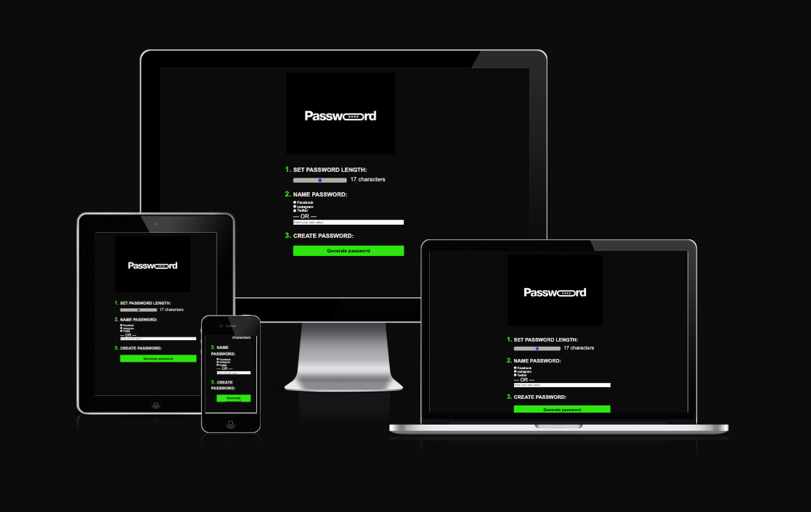
<a href="https://ocimar84.github.io/java-project/" target="_blank">View live website here.</a>

<h2>Table of Contents</h2>

 - [Features](#features)
 - [Technologies](#technologies)
    - [Languages Used](#languages)
    - [Frameworks, Libraries & Programs Used](#flp)
- [Testing](#testing)
    - [Lighthouse](#lighthouse)
    - [HTML Validation](#html)
    - [CSS Validation](#css)
    - [JS Validation](#js)
    - [Manual Testing](#manual-testing)
    - [Further Testing](#further-testing)
    - [Fixed issues found during testing](#fixed)
    - [Errors and warnings](#errors)
- [Deployment](#deployment)
    - [Project Creation](#project-creation)
    - [Start Project in Gitpod](#start-project)
    - [Run Project Live Preview](#live-preview)
    - [GitHub Pages](#github-pages)
    - [Git commands](#git-commands)
- [Future Features](#future-features)
- [Credits](#credits)
- [Acknowledgements](#acknowledgements)
   

<h3 id="features">Features</h3>

>LOGO
<ul>
    <li>The logo, which is visible at the top of the page, aids users in understanding the purpose of the website.</li>

    
 
</ul> 

>Slider
<ul>
    <li>Determines how many characters the user needs to password by simply setting by holding the button and pressing left for fewer characters or right for more. .</li>
  <li>Works at least 7 maximum 27 characters.</li>
   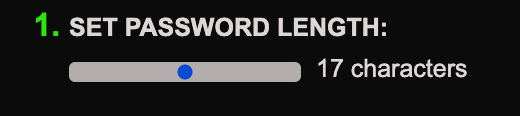 
 
</ul> 

>Password options
<ul>
    <li>In order to identify the password that was generated if the user ever needs to go back and copy the password, the selected choice will generate either an icon or text next to the password.</li>
    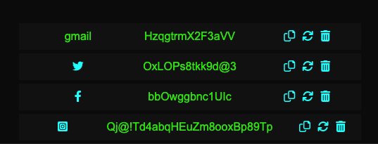 
    <li>Facebook </li>
    <li>Instagram</li>
    <li>Twitter</li>
    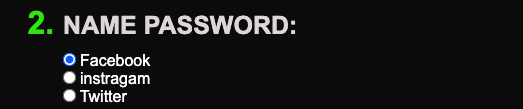    
    <li>Just type in the application used that the password will be randomly generated.</li>
     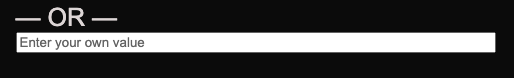       
    <li>User can choose by typing which password he needs through which site or tool needs password, just type choose how many characters the password will appear in the history with the name entered.</li>
    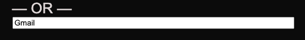     
</ul> 

>Create Password.
<ul>
    <li>Simply click the Generate password button where the options previously selected will be randomly generated according to the user's need.</li>
    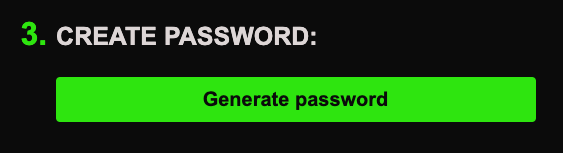        
    <li>By selecting GENERATE PASSWORD, the password will be created and saved in local storage as well as displayed in the history div. If the user were to leave the website, their password would still be available in case they ever forgot it.</li> 
</ul> 

>Generate Password.
<ul>
    <li>After clicking on the button to generate password your password will be in the middle with the number of characters that was selected, each created password will have icons that allow you to copy, regenerate, or delete the password.</li>
    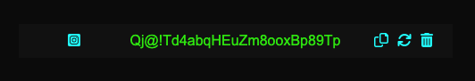        
    <li>You can see that on the left side it is specifying with the logo of which social media the password was created, in the example below Facebook</li> 
    
    <li>In the center we will have the user's password.</li> 
    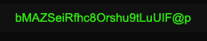
    <li>On the right side we have 3 options:</li>
    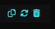
    <li>Copy - Its own name says it copies the password and generates a window confirming the command.</li>  
    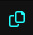
    <li>Refresh - Generates a new password if you are not satisfied with the generated password.
</li>  
    
     <li>Garbage - Deletes the password in which it was created.</li>
     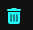
     <li>User can see all generated passwords in a list that is at the bottom of the site.</li>
     
     <li>If the user clicks on the password he can save the password in a popup window that appears at the top of the website.</li>
    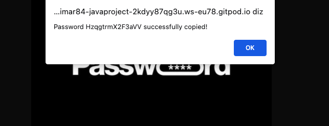    

</ul> 

<h2 id="design">Design</h2>
<ul>
    <li id="typography">Typography
        <ul>
            <li>All text elements on the page use the Montserrat font, making the content simple to read. If the primary font cannot load for any reason, sans-serif is applied as a backup. Additionally, the user is provided with two other options to choose from and change  between Poppins and Oswald as these are provided in the themes menu.</li>
        </ul>
    </li>
    <li id="color">Colour Scheme
        <ul>
            <li>The primary colour for the application is various hues of green. The user is given an additional 3 alternatives to select from themes menu, including various blue, grey, and pink hues, to adjust the colour scheme they desire.</li>
        </ul>
    </li>
    <li id="imagery"> Imagery
        <ul>
            <li>I chose a picture of a pen and paper to signify a diary and to tie in with the overall application design.</li>
        </ul>
    </li>
</ul>

<h3 id="adobe-design">Adobe XD Design</h3>
<h4 id="main-design">Main page design</h4>

<h4 id="theme-design">Theme menu design</h4>

<h4 id="favicon-design">Favicon design</h4>

<h2 id="technologies">Technologies</h2>

<h3 id="languages">Languages Used</h3>
<ul>
    <li><a href="https://en.wikipedia.org/wiki/HTML" target="_blank">HTML5</a></li>
    <li><a href="https://en.wikipedia.org/wiki/CSS" target="_blank">CSS3</a></li>
    <li><a href="https://en.wikipedia.org/wiki/JavaScript" target="_blank">JavaScript</a></li>
</ul>

<h2 id="flp">Frameworks, Libraries & Programs Used</h2>

<ul>
    <li><a href="https://fonts.google.com/" target="_blank">Google Fonts</a>
        <ul>
            <li>Google fonts were used to import the 'Roboto Serif' font into the style.css file which is used on all text elements.</li>
        </ul>
    </li>
</ul>
<ul>
    <li><a href="https://fontawesome.com/" target="_blank">Font Awesome</a>
        <ul>
            <li>Font Awesome was used for social links and google review button.</li>
        </ul>
    </li>
</ul>
<ul>
    <li><a href="https://git-scm.com/" target="_blank">Git</a>
        <ul>
            <li>Git was used for version control by utilizing the Gitpod terminal to commit to Git and Push to GitHub.</li>
        </ul>
    </li>
</ul>
<ul>
    <li><a href="https://github.com/" target="_blank">GitHub</a>
        <ul>
            <li>GitHub was used to store the projects code after being pushed from Git.</li>
        </ul>
    </li>
</ul>
<ul>
    <li><a href="https://www.adobe.com/ie/products/photoshop-lightroom.html?gclid=Cj0KCQjwnvOaBhDTARIsAJf8eVOjH4dPSEF5YUvt-cy_GQOAe-YZNeQC-b-f9an8MbE2ZYIu9-4XgyEaAsQaEALw_wcB&mv=search&mv=search&sdid=L7NVTQ8Y&ef_id=Cj0KCQjwnvOaBhDTARIsAJf8eVOjH4dPSEF5YUvt-cy_GQOAe-YZNeQC-b-f9an8MbE2ZYIu9-4XgyEaAsQaEALw_wcB:G:s&s_kwcid=AL!3085!3!547896439650!e!!g!!adobe%20lightroom!1423511177!58810487274" target="_blank">Adobe Lightroom</a>
        <ul>
            <li>Adobe Lightroom was used to add color preset for all photos.</li>
        </ul>
    </li>
</ul>
<ul>
    <li><a href="https://www.adobe.com/ie/products/photoshop.html?gclid=Cj0KCQjwnvOaBhDTARIsAJf8eVO3rRHxJnLt7dFLsz9rBsMrQoVGoDK5svXE0qzu0eMgLEzLGhT-dPgaAofzEALw_wcB&mv=search&mv=search&sdid=LZ32SYVR&ef_id=Cj0KCQjwnvOaBhDTARIsAJf8eVO3rRHxJnLt7dFLsz9rBsMrQoVGoDK5svXE0qzu0eMgLEzLGhT-dPgaAofzEALw_wcB:G:s&s_kwcid=AL!3085!3!441704131147!e!!g!!adobe%20photoshop!1423511192!58810496314" target="_blank">Adobe Photoshop</a>
        <ul>
            <li>Adobe Photoshop was used to resize all the images.</li>
        </ul>
    </li>
</ul>
<ul>
    <li><a href="https://www.adobe.com/uk/products/xd.html" target="_blank">Adobe XD</a>
        <ul>
            <li>Adobe XD was used to create the prototype of the website.</li>
        </ul>
    </li>
</ul>
<ul>
    <li><a href="https://www.gitpod.io/" target="_blank">Gitpod</a>
        <ul>
            <li>Gitpod was used to develop the website.</li>
        </ul>
    </li>
</ul>
<ul>
    <li><a href="https://sweetalert2.github.io/" target="_blank">Sweet alert</a>
        <ul>
            <li>Sweet Alert was used to inform the user that the input is empty while adding a list item with an empty input.</li>
        </ul>
    </li>
</ul>

<h2 id="testing">Testing</h2>

<h3 id="lighthouse">Lighthouse</h3>

<h3 id="html">HTML Validation</h3>

<h3 id="css">CSS Validation</h3>

<h3 id="js">JS Validation</h3>

<h3 id="manual-testing">Manual Testing</h3>
<ul>
    <li><a href="https://youtu.be/kciy9pvKW2o" target="_blank">Responsiveness</a>Responsiveness was tested using google chrome dev tools for desktop, tablet and mobile device.</li>
    <li><a href="https://youtu.be/Gn2vCe2qrqE" target="_blank">External links </a>All links to external websites were tested that they are opening up on a new tab by clicking on each one of them.</li>
    <li><a href="https://youtu.be/S8hMzuJjaI0" target="_blank">Themes button </a>The themes pop-up menu button was tested by clicking on the button and visualy checking if the menu will open up on the screen.</li>
    <li><a href="https://youtu.be/VEtvQUg1MNE" target="_blank">Color themes selection</a>The test was done by navigating to themes menu and selecting each color theme option and visually inspect if there were changes made to color theme.</li>
    <li><a href="https://youtu.be/xjLY78MXA5g" target="_blank">Font types selection</a>The test was done by navigating to themes menu and selecting each font type  option and visually inspect if there were changes made to font.</li>
    <li><a href="https://youtu.be/KPDpOIN0GVU" target="_blank">Sweet alert </a>The test was conducted by trying to add a todo list item while the input was empty.</li>
    <li><a href="https://youtu.be/cMx8Gj5ipzw" target="_blank">Adding todo item </a>The test was carried out by entering the text in the input and selecting the add todo button./li>
    <li><a href="https://youtu.be/cJDsTsPp7EM" target="_blank">Todo list item controles </a>The test was carried out by  simply hovering over each item on the todo list. The control menu would appear as soon as the mouse was over the todo list item./li>
    <li><a href="https://youtu.be/3y8Dv91pWrQ" target="_blank">Check button </a>The test was carried out by clicking on the check button next to each item on the todo list. When the button is clicked on the selected task, the task's style is changed to checked./li>
    <li><a href="https://youtu.be/eINIbplCiXw" target="_blank">Edit button </a>Each task on the to-do list included an edit button, which was used to perform the test. When the user clicks the edit button on the selected task, the input for the list items toggles to enabled, enabling them to change the task's text. If they click the button again, the input changes to disabled./li>
    <li><a href="https://youtu.be/9v_giEijWf4" target="_blank">Delete button </a>The test was carried out by clicking on the delete button next to each todo list item, which removed the todo item.</li>
</ul>

<h3 id="further-testing">Further Testing</h3>
<ul>
    <li>Responsiveness was tested using <a href="https://ui.dev/amiresponsive?url=https://eambrozas.github.io/to-do-list/" target="_blank">ui.dev</a></li>
    <li>The Website was tested on Google Chrome, Microsoft Edge and Firefox browsers.</li>
    <li>The website was viewed on a variety of devices such as Desktop, Laptop, Samsung Galaxy s9, Galaxy a13, Galaxy a50s.</li>
    <li>Every link on the website was testes that it is linked correctly.</li>
    <li>User Experience issues were tested by friends, family and slack community.</li>
    <li>Lighthouse report was generated for the website.</li>
    <li>HTML was checked by Markup Validation Service.</li>
    <li>CSS was checked by CSS Validation Service.</li>
    <li>JavaScript validator was used to validate JavaScript.</li>
    <li>Console log was used throughout the building process to check if there were any errors.</li>
</ul>

<h3 id="fixed">Fixed issues found during testing</h3>
<ul>
    <li>The background image on the website was of a high resolution, resulting in performance drop on mobile devices : Fixed by changing the size and format of the image.</li>
    <li>The check mark was not correctly aligned with the task: To-do list item padding and the top margin for the checkmark were changed to fix the issue.</li>
    <li>Uncaught ReferenceError: hideEditMenu is not defined at HTMLButtonElement.onclick ((index):77:65) : Fixed by removing the onclick attribute in html file on line 77 for popup close button.</li>
</ul>

<h3 id="errors">Errors and warnings</h3>
<ul>
    <li>These were warnings generated in css validator due to sweet alert css link that I decided to ignore as it was not cosing any issues.
         
    </li>
    <li>I was receiving an undefined variable for sweet alert while checking the JS file on jshint.com and a few of other websites. But since there were no errors and everything was operating as it should, it was ignored.
         
    </li>
</ul>

<h2 id="deployment">Deployment</h2>

<h3 id="project-creation">Project Creation</h3>
<ul>
    <li>
    I used <a href="https://github.com/Code-Institute-Org/gitpod-full-template" target="_blank">Code Institute Template</a> to start the project by clicking on a 'Use this template' dropdown menu and selecting 'Create a new repository'. I gave it a repository name 'to-do-list', checked the Include all branches checkbox and clicked on a green button called 'Create repository from template' to create repository.
    </li>
</ul>

<h3 id="start-project">Start Project in Gitpod</h3>
<ol>
    <li>Navigate to the Github <a href="https://github.com/EAmbrozas/to-do-list" target="_blank">repository</a>.</li>
    <li>Clik green 'Gitpod' button.</li>
</ol>

<h3 id="live-preview">Run Project Live Preview</h3>
<ol>
    <li>Open the project in Gitpod.</li>
    <li>Add 'python3 -m http.server' command in terminal.</li>
    <li>Click 'open preview' button to view the project with in Gitpod text editor or click 'open browser' button to view project in browser.</li>
</ol>

<h3 id="github-pages">GitHub Pages</h3>
<ol>
    <li>Navigate to <a href="https://github.com/EAmbrozas/to-do-list" target="_blank">GitHub</a> repository.</li>
    <li>Go to Settings > Pages.</li>
    <li>Select main branche as the source.</li>
    <li>Click 'save' button.</li>
    <li>Click the 'Visit site' button to open up deployed website.</li>
</ol>

<h3 id="git-commands">Git commands</h3>
<ul>
    <li>git status - displays the state of the working directory and the staging area.</li>
    <li>git add . - adds a change in the working directory to the staging area.</li>
    <li>git commit -m "Commit message" - used to save changes to the local repository.</li>
    <li>git push - upload local repository content to a remote repository.</li>
</ul>

<h2 id="future-features">Future Features</h2>

<ul>
    <li>Add local storage or something similar.</li>
    <li>Add the ability to set date and time for each todo list item.</li>
    <li>Add a drop down menu that can filter between different types of tasks. For example checked and unchecked.</li>
</ul>

<h2 id="credits">Credits</h2>

<ul>
    <li><a href="https://webdesign.tutsplus.com/tutorials/color-schemes-with-css-variables-and-javascript--cms-36989" target="_blank">webdesign.tutsplus.com</a> On how to change the website to different colort themes.</li>
    <li><a href="https://uiverse.io/" target="_blank">UNIVERSE</a> For nicely styled button that were used in the project.</li>
    <li><a href="https://www.pexels.com/" target="_blank">PEXELS</a> For the image that was used in the project.</li>
</ul>

<h2 id="acknowledgements">Acknowledgements</h2>

<ul>
    <li>A very big thanks to my Mentor Ronan for valuable feedback.</li>
    <li>My Cohort lead Kasia for support.</li>
    <li>All the people that invested their time to review and test UI/UX of the project.</li>
</ul>