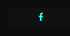

<h1>Password Generator</h1>

The second project for Code Institute, you are tired of thinking about random passwords with this password generator tool will help you a lot, the project has been in difficulty thinking about generating random passwords for various websites or applications it helps you with random numbers and letters or even characters.

Password generator will help you create a secure password just by clicking a button.

Besides being able to change your passwords by character size or even generate password for specific sites such as Facebook, Instagram and twitter, if I need a delet password for another platform it can help you by writing to where you need the password.

<a href="https://ocimar84.github.io/java-project/" target="_blank">View live website here.</a>

<h2>Table of Contents</h2>

 - [Features](#features)
 - [Design](#design)
     - [Typography](#typography)
     - [Color](#color)
     - [Images](#images)
 - [Technologies](#technologies)
    - [Languages Used](#languages)
    - [Frameworks, Libraries & Programs Used](#flp)
- [Testing](#testing)
    - [Lighthouse](#lighthouse)
    - [Color Contrast](#color)
    - [HTML Validation](#html)
    - [CSS Validation](#css)
    - [JS Validation](#js)
    - [Further Testing](#further-testing)
- [Deployment](#deployment)
    - [Project Creation](#project-creation)
    - [Start Project in Gitpod](#start-project)
    - [Run Project Live Preview](#live-preview)
    - [GitHub Pages](#github-pages)
    - [Git commands](#git-commands)
- [Credits](#credits)
- [Acknowledgements](#acknowledgements)
   

<h2 id="features">Features</h2>

>LOGO
<ul>
    <li>The logo, which is visible at the top of the page, aids users in understanding the purpose of the website.</li>

    
 
</ul> 

>Slider
<ul>
    <li>Determines how many characters the user needs to password by simply setting by holding the button and pressing left for fewer characters or right for more. .</li>
  <li>Works at least 7 maximum 27 characters.</li>
    
 
</ul> 

>Password options
<ul>
    <li>In order to identify the password that was generated if the user ever needs to go back and copy the password, the selected choice will generate either an icon or text next to the password.</li>
     
    <li>Facebook </li>
    <li>Instagram</li>
    <li>Twitter</li>
        
    <li>Just type in the application used that the password will be randomly generated.</li>
            
    <li>User can choose by typing which password he needs through which site or tool needs password, just type choose how many characters the password will appear in the history with the name entered.</li>
         
</ul> 

>Create Password.
<ul>
    <li>Simply click the Generate password button where the options previously selected will be randomly generated according to the user's need.</li>
            
    <li>By selecting GENERATE PASSWORD, the password will be created and saved in local storage as well as displayed in the history div. If the user were to leave the website, their password would still be available in case they ever forgot it.</li> 
</ul> 

>Generate Password.
<ul>
    <li>After clicking on the button to generate password your password will be in the middle with the number of characters that was selected, each created password will have icons that allow you to copy, regenerate, or delete the password.</li>
            
    <li>You can see that on the left side it is specifying with the logo of which social media the password was created, in the example below Facebook</li> 
    
    <li>In the center we will have the user's password.</li> 
    
    <li>On the right side we have 3 options:</li>
    
    <li>Copy - Its own name says it copies the password and generates a window confirming the command.</li>  
    
    <li>Refresh - Generates a new password if you are not satisfied with the generated password.
</li>  
    
     <li>Garbage - Deletes the password in which it was created.</li>
     
     <li>User can see all generated passwords in a list that is at the bottom of the site.</li>
     
     <li>If the user clicks on the password he can save the password in a popup window that appears at the top of the website.</li>
        

</ul> 

<h2 id="design">Design</h2>
<ul>
    <li id="typography">Typography
        <ul>
            <li>Poppins was the website's primary font, with sans-serif serving as a backup.</li>
        </ul>
    </li>
    <li id="color">Color
        <ul>
            <li>The primary colors chosen were black and white, as well as green to represent the password generation processes and blue for icons.</li>
        </ul>
    </li>
    <li id="images">Images
        <ul>
            <li>The picture of loggo I discovered it via Google and decided that it would complement the project well, matching the design as well.</li>
        </ul>
    </li>
</ul>

<h2 id="technologies">Technologies</h2>

<h3 id="languages">Languages Used</h3>
<ul>
    <li><a href="https://en.wikipedia.org/wiki/HTML" target="_blank">HTML5</a></li>
    <li><a href="https://en.wikipedia.org/wiki/CSS" target="_blank">CSS3</a></li>
    <li><a href="https://en.wikipedia.org/wiki/JavaScript" target="_blank">JavaScript</a></li>
</ul>

<h3 id="flp">Frameworks, Libraries & Programs Used</h3>

<ul>
    <li><a href="https://fonts.google.com/" target="_blank">Google Fonts</a>
        <ul>
            <li>Google fonts were used to import the 'Roboto Serif' font into the style.css file which is used on all text elements.</li>
        </ul>
    </li>
</ul>
<ul>
    <li><a href="https://fontawesome.com/" target="_blank">Font Awesome</a>
        <ul>
            <li>Font Awesome was used for social links and google review button.</li>
        </ul>
    </li>
</ul>
<ul>
    <li><a href="https://git-scm.com/" target="_blank">Git</a>
        <ul>
            <li>Git was used for version control by utilizing the Gitpod terminal to commit to Git and Push to GitHub.</li>
        </ul>
    </li>
</ul>
<ul>
    <li><a href="https://github.com/" target="_blank">GitHub</a>
        <ul>
            <li>GitHub was used to store the projects code after being pushed from Git.</li>
        </ul>
    </li>
</ul>

<ul>
    <li><a href="https://www.gitpod.io/" target="_blank">Gitpod</a>
        <ul>
            <li>Gitpod was used to develop the website.</li>
        </ul>
    </li>
</ul>

<h2 id="testing">Testing</h2>

<h3 id="lighthouse">Lighthouse</h3>

<h3 id="color">Color Contrast</h3>

<h3 id="html">HTML Validation</h3>

<h3 id="css">CSS Validation</h3>

<h3 id="js">JS Validation</h3>

<h3 id="further-testing">Further Testing</h3>
<ul>
    <li>Responsiveness was tested using <a href="https://ui.dev/amiresponsive?url=https://ocimar84.github.io/java-project/" target="_blank">ui.dev</a></li>
    <li>Google Chrome, Microsoft Edge, and Firefox were used to test the website.</li>
    <li>The website was viewed on a variety of devices such as Desktop, Laptop and phones.</li>
    <li>Friends and relatives checked for user experience problems.</li>
    <li>Throughout the construction process, console log was used to check any faults.</li>
</ul>
<h2 id="deployment">Deployment</h2>

<h3 id="project-creation">Project Creation</h3>
<ul>
    <li>
    I used <a href="https://github.com/Code-Institute-Org/gitpod-full-template" target="_blank">Code Institute Template</a> to launch the project by selecting "Create a new repository" from a dropdown menu labeled "Use this template." In order to construct the repository, I gave it the name "java-project," ticked the Include all branches box, and then clicked on the green "Create repository from template" button.
    </li>
</ul>

<h3 id="start-project">Start Project in Gitpod</h3>
<ol>
    <li>Navigate to the Github <a href="https://ocimar84.github.io/java-project/" target="_blank">repository</a>.</li>
    <li>Clik green 'Gitpod' button.</li>
</ol>

<h3 id="live-preview">Run Project Live Preview</h3>
<ol>
    <li>Open the project in Gitpod.</li>
    <li>Add 'python3 -m http.server' command in terminal.</li>
    <li>Click 'open preview' button to view the project with in Gitpod text editor or click 'open browser' button to view project in browser.</li>
</ol>

<h3 id="github-pages">GitHub Pages</h3>
<ol>
    <li>Navigate to <a href="https://github.com/ocimar84/java-project" target="_blank">GitHub</a> repository.</li>
    <li>Go to Settings > Pages.</li>
    <li>Select main branche as the source.</li>
    <li>Click 'save' button.</li>
    <li>Click the 'Visit site' button to open up deployed website.</li>
</ol>

<h3 id="git-commands">Git commands</h3>
<ul>
    <li>git status - displays the state of the working directory and the staging area.</li>
    <li>git add . - adds a change in the working directory to the staging area.</li>
    <li>git commit -m "Commit message" - used to save changes to the local repository.</li>
    <li>git push - upload local repository content to a remote repository.</li>
</ul>

<h2 id="credits">Credits</h2>

<ul>
    <li><a href="https://www.google.com/?client=safari" target="_blank">Google</a> Logo images via google.</li>
    <li><a href="https://www.youtube.com" target="_blank">Youtube</a> Help with several tutorials that helped me develop this site.</li>
 </ul>

<h2 id="acknowledgements">Acknowledgements</h2>

<ul>
    <li>Thanks to Malia, my mentor, for all of her guidance and assistance.</li>
   </ul>